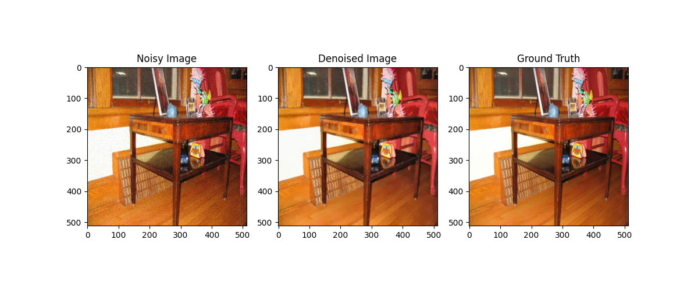
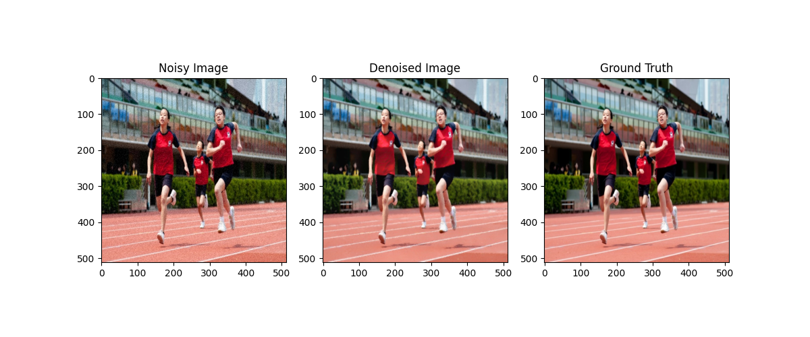
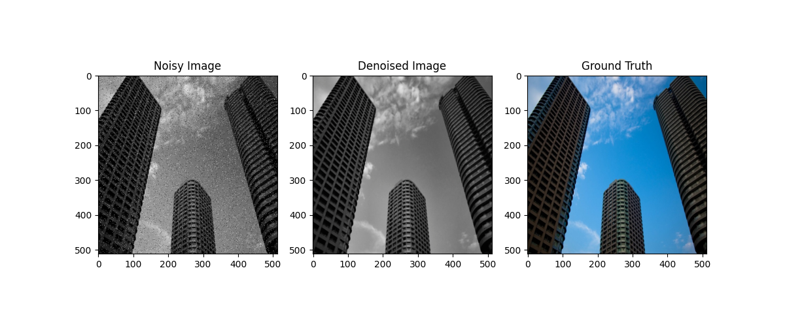

<h2>Features</h2>
<ul>
    <li>Uses Non-Local Means Denoising for noise reduction.</li>
    <li>Applies CLAHE (Contrast Limited Adaptive Histogram Equalization) for contrast enhancement.</li>
    <li>Computes SSIM to measure similarity with the ground truth image.</li>
    <li>Visualizes results using Matplotlib.</li>
</ul>

<h2>Installation</h2>

Ensure you have Python installed, then install the required dependencies:

<pre><code>pip install opencv-python numpy matplotlib scikit-image</code></pre>

<h2>Usage</h2>

Place your noisy image and ground truth image in the working directory and modify the script to load them:

<pre><code>
<h2>Output</h2>

The output obtained from the script

Additionally, it prints the SSIM score to evaluate the quality of the denoising process.

<h2>Try it Out!</h2>

Try it out here: <a href="https://shivanshsingh.pythonanywhere.com/">Example Output</a>

<h2>License</h2>

This project is open-source and available under the MIT License.

